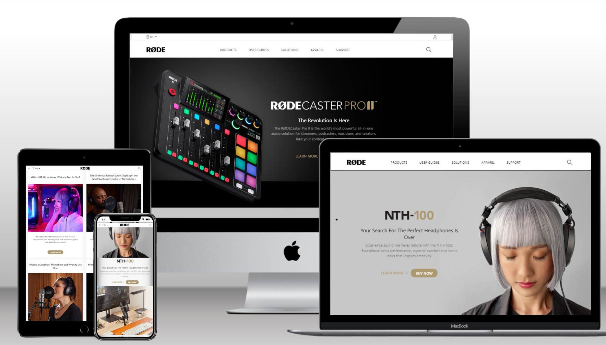

# Rode.com Home-Page Clone Using TailwindCSS

> ### **Deployed Website** :-[Live Link](https://ui-clone-rode.netlify.app/)
 

## Project key takeaways:

  - Used Only **Html** and **TailwindCSS**
  - Learned to create **Mobile Responsive**, **fast-paced websites** using the CSS utility library TailwindCSS.
  - I played with images' auto width and height features and learned to make them responsive using TailwindCSS.
  - Learned to manipulate **SVG** file color while hovering, stroke-width  and size through the TailwindCSS
  - I learned a lot about positioning in TailwindCSS.

   

 

> ## It took around 11 hours to complete and make this project **Multidevice** Responsive.
